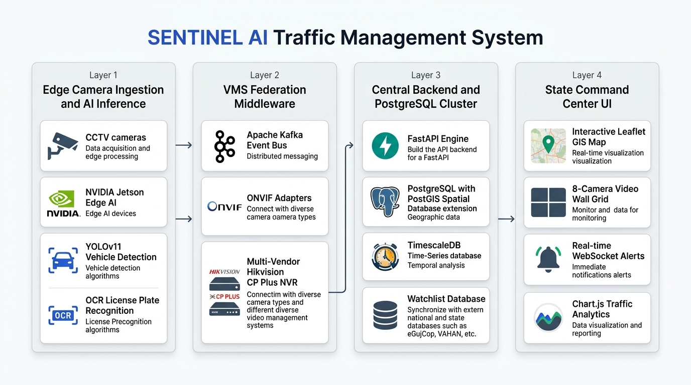
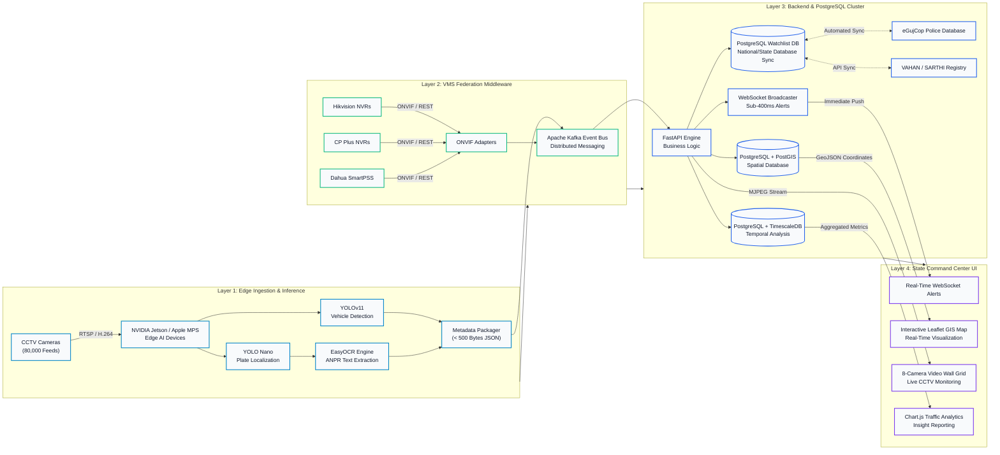

# SENTINEL — End-to-End System Architecture & Data Flow

**Gujarat Police Innovation Challenge 2026**  
**Scalable AI Traffic Management & Video Surveillance Platform (80,000 Cameras)**

---

## 1. System Architecture Overview (Clean & Minimal)



The SENTINEL platform is designed to overcome the state-wide **320 Gbps bandwidth bottleneck** of 80,000 cameras by employing an **Edge-Cloud Hybrid Architecture** paired with a **PostgreSQL enterprise cluster** (PostGIS + TimescaleDB) and **Zero-Disruption VMS Federation**.

---

## 2. Interactive Mermaid Architecture Flow



---

## 3. Step-by-Step Data Flow Breakdown

### Step 1: Camera Ingestion & Frame Capture (Layer 1)
- **Source**: 80,000 CCTV streams across 26 Gujarat Government departments (Police, Municipal Corporations, RTO, Revenue, Ports).
- **Transport**: Standard RTSP streams over TCP with H.264/H.265 compression.
- **Decoding**: Frame buffers ingested via OpenCV `VideoCapture` utilizing hardware NVDEC on NVIDIA or VideoToolbox on Apple Silicon.

### Step 2: Edge AI Dual-Model Inference (Layer 1)
- **Primary Stage (Vehicle Classification)**: Ultralytics YOLOv11 runs inference on full-resolution frames, classifying targets into `Car`, `Motorcycle`, `Bus`, `Truck` at >30 FPS.
- **Secondary Stage (License Plate Localization)**: Custom-trained YOLO Nano weights locate High-Security Registration Plates (HSRP) and standard Indian license plates.
- **ANPR Text Extraction**: Bounding box regions are cropped, pre-processed (grayscale + adaptive thresholding), and parsed through EasyOCR to extract plate numbers (e.g., `GJ01DX5432`).
- **Data Minimization (The 96% Bandwidth Fix)**: Instead of streaming 4 Mbps raw video to state headquarters, the edge node bundles telemetry into a lightweight JSON payload (< 500 bytes):
  ```json
  {
    "camera_id": "GJ-AHM-001",
    "timestamp": "2026-09-15T05:10:00Z",
    "plate_number": "GJ01DX5432",
    "vehicle_class": "Car",
    "confidence": 0.96,
    "gps": {"lat": 23.0300, "lon": 72.5800}
  }
  ```

### Step 3: Zero-Disruption VMS Federation Middleware (Layer 2)
- **Vendor Abstraction**: Departmental NVRs (Hikvision, CP Plus, Dahua) continue to store 15–30 days of raw historical video locally without disruption.
- **ONVIF & REST Adapters**: Proprietary APIs are normalized into a unified event schema.
- **Message Broker**: Payloads are published to high-throughput **Apache Kafka** partitioned message queues, ensuring zero message loss and decoupling edge capture from central storage.

### Step 4: Central Ingestion & PostgreSQL Enterprise Storage (Layer 3)
- **API Orchestration**: FastAPI consumes messages from Kafka topics and executes asynchronous tasks.
- **PostGIS Spatial Database**:
  - Stores all 80,000 camera geometries (`GEOMETRY(Point, 4326)`).
  - Handles spatial radius queries (`ST_DWithin`) and dynamic trajectory generation (`ST_MakeLine`).
- **TimescaleDB Time-Series Engine**:
  - Partitions millions of vehicle detection events into automated hypertables.
  - Guarantees sub-50ms query response times even with tens of millions of records.
- **Watchlist Cross-Referencing**:
  - Hot lookups against the ACID PostgreSQL `watchlist` table.
  - Continuous ETL sync against **eGujCop** (stolen vehicles & FIR suspects), **VAHAN** (blacklisted & expired fitness), and **SARTHI** (disqualified licenses).

### Step 5: Sub-Second Alert Dispatch & State Command UI (Layer 4)
- **Push Notification Pipeline**: When an offense match is flagged, the FastAPI WebSocket manager broadcasts the payload in **< 400 milliseconds**.
- **Interactive Leaflet GIS Map**:
  - Real-time pinpointing of camera locations color-coded by department.
  - Instant spatiotemporal vehicle journey tracing with animated red polylines and clickable waypoint cards.
- **Multi-Cell Video Wall**:
  - Low-latency browser streams for targeted junction monitoring with single-click modal expansion.
- **Visual Traffic Volume Analytics**:
  - Chart.js renders 7-day volume trends comparing law enforcement vs. civil departmental counts.
- **Judicial Export**:
  - 1-click generation of court-admissible CSV/PDF audit reports (`sentinel_evaluation_output_report.csv`).

---

## 4. Key Metrics & Impact

| Metric | Legacy Statewide Approach | SENTINEL Platform Architecture |
| :--- | :--- | :--- |
| **Network Bandwidth (80k cams)** | ~320 Gbps (Raw 1080p video) | **< 10 Gbps (>96% Bandwidth Reduction)** |
| **Alert Latency** | Manual search (hours/days) | **< 400 milliseconds (Real-Time WebSocket)** |
| **Departmental Disruption** | High (Requires replacing NVRs) | **Zero (Universal ONVIF/API Federation)** |
| **Database Scalability** | Flat files / simple SQL bottlenecks | **PostgreSQL + PostGIS + TimescaleDB** |
| **Vehicle Trajectory Tracking** | Manual video stitching | **Instant Automated GIS Polyline Tracing** |
